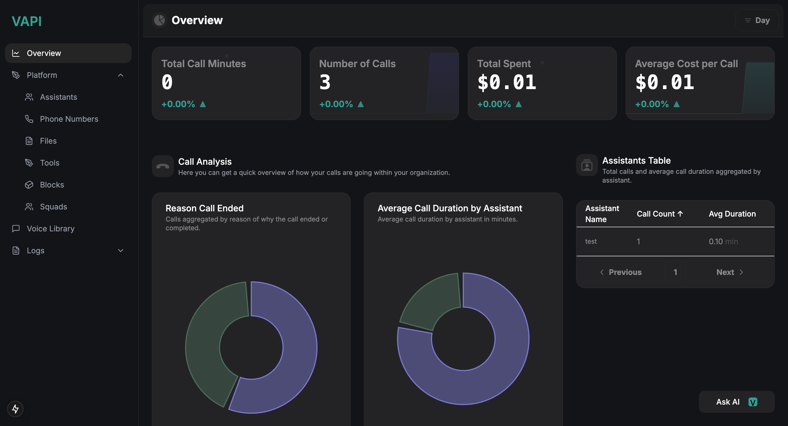
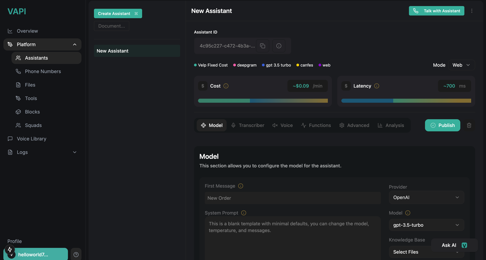
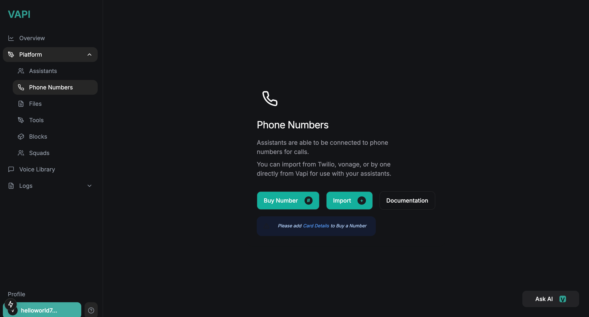
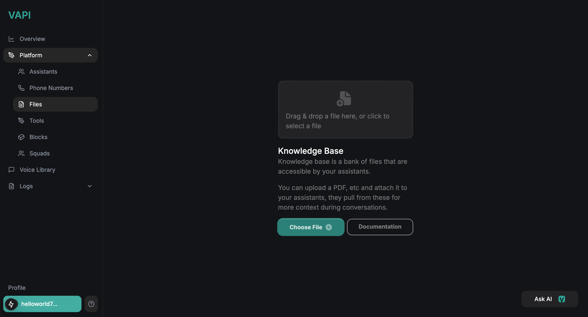
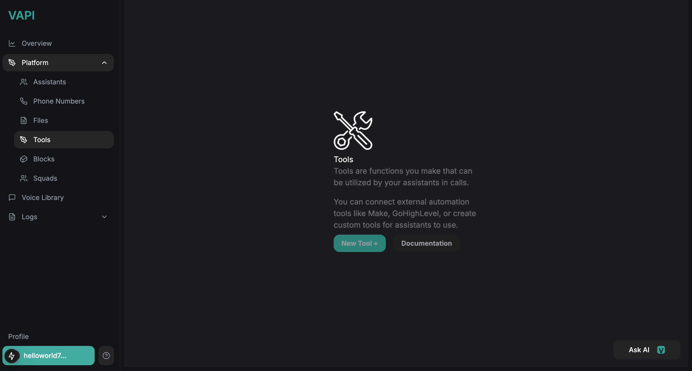
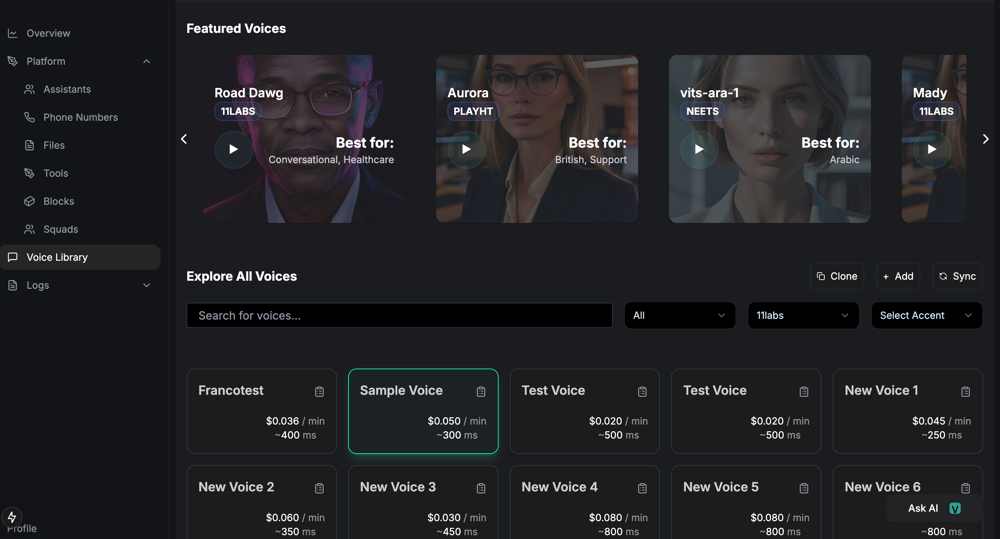

# DAPA- A VAPI BASED AI ASSISTANT
DAPA (Dynamic AI-Powered Assistant) is an intelligent, voice-enabled system built using Vapi, designed to offer seamless conversational AI experiences tailored for various real-world applications. Whether it’s task automation, smart assistant features, or contextual understanding, DAPA combines the power of Vapi’s voice capabilities with custom AI models to deliver fast, accurate, and human-like interactions.

Key Features:

🔊 Real-time voice interaction powered by Vapi

🤖 Custom AI logic for contextual task execution

🧠 Integrates NLP/NLU for smarter understanding

⚡ Lightweight and optimized for speed and scalability

🌐 Built with extensibility in mind for IoT and mobile platforms

DAPA is part of my broader vision to make AI assistants more personal, context-aware, and regionally adaptable — beginning from Vapi, India.
